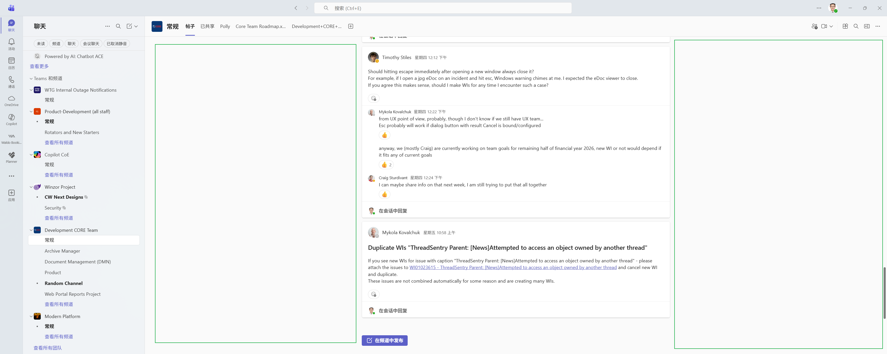

# 加强版Teams Channel

## 背景

这是我目前使用的Development CORE Team的Teams Channel的样子：

它有一个问题：有很多个子频道，但是这些子频道是人工分类的，分类不够细致，而且有些子频道内容重复，导致如果我有一个问题，我不知道该去哪个子频道提问。

## 目标

我希望有一个加强版的Development CORE Team的Teams Channel，它能够通过AI，根据内容自动分类，并且能够根据用户的问题推荐最相关的子频道。

## 视觉效果

目前的Channel中只有最中间显示了当前子频道内容，而周围有很多空闲区域（即图中绿色框出的区域：），我希望能够利用这些空闲区域，构造一个类似于任务栏中轮播的UI界面，其中正中心位置显示当前子频道内容，左右两侧显示相邻子频道内容缩略预览图，用户可以通过点击左右两侧的缩略图来切换当前子频道内容。

## 具体功能需求

1. 你需要帮我实现和原生Teams尽可能一样的基本UI界面设计，并在此基础上添加包含任务栏轮播的UI设计。
2. 你需要帮我实现AI自动分类子频道的功能，能够根据子频道内容进行细致分类，并且避免内容重复。
3. 你需要帮我实现根据用户问题推荐最相关子频道的功能，能够根据用户输入的问题，推荐最相关的子频道供用户选择。
4. 你需要为它设计一套supabase数据库schema，并且为这个数据库添加一些初始数据，方便测试和展示功能。这些初始数据需要以中文形式提供，并且涵盖不同的类型，例如：技术讨论，产品设计，Bug反馈，文档分享，生活日常等。

## 技术要求

你可以使用任何你喜欢的Web技术，并且这是一个Demo项目，所以你不需要考虑其它效果的实现，例如正常的Teams聊天，通话等，你只需要实现上述功能即可。

## 主要优势

1. 发帖的时候自动匹配子频道，减少用户选择子频道的时间成本。
2. 利用了频道左右的空闲区域，提升了UI的利用率。